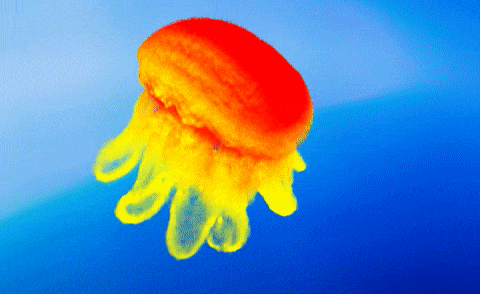
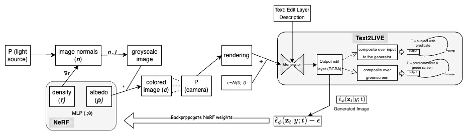
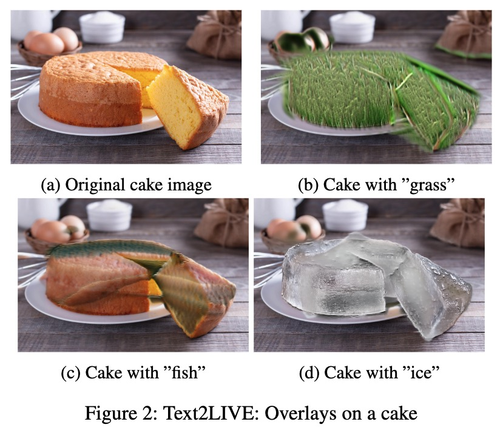
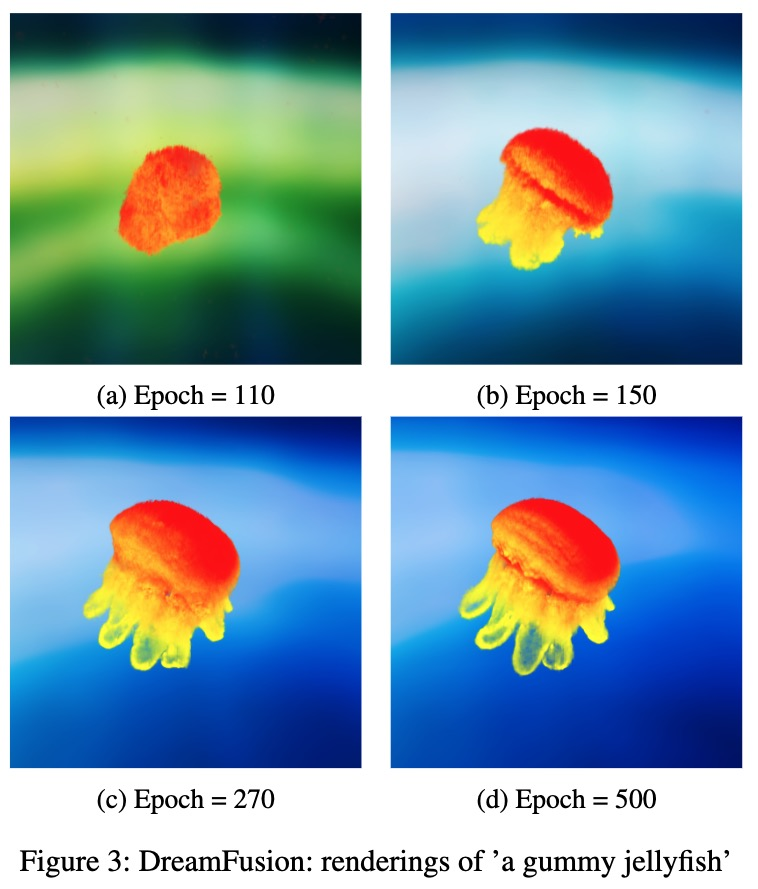

[![Contributors][contributors-shield]][contributors-url]
[![Forks][forks-shield]][forks-url]
[![Stargazers][stars-shield]][stars-url]
[![Issues][issues-shield]][issues-url]
[![MIT License][license-shield]][license-url]
[![LinkedIn][linkedin-shield]][linkedin-url]

<!-- PROJECT LOGO -->
 

    

  <h2 align="center">Text2LIVE-3D (BU GRS CS640 Project 2022)</h2>

  

    Generate 3D renderings of an existing 2D image by modifying the subject based on a text prompt
     
    <a href="https://github.com/animikhaich/Text2LIVE-3D/issues/new">Report Bug</a>
    ·
    <a href="https://github.com/animikhaich/Text2LIVE-3D/issues/new">Request Feature</a>
  

  

<!-- TABLE OF CONTENTS -->

## Table of Contents

- [Table of Contents](#table-of-contents)
- [About The Project](#about-the-project)
- [Proposed Architecture](#proposed-architecture)
- [Preliminary Results](#preliminary-results)
    - [Text2LIVE](#text2live)
  - [Stable DreamFusion](#stable-dreamfusion)
- [Hardware Requirements](#hardware-requirements)
- [Setup and Usage](#setup-and-usage)
- [License](#license)
- [Contributors](#contributors)
    - [Animikh Aich](#animikh-aich)
    - [Himanshu Patil](#himanshu-patil)
    - [Vedika Srivastava](#vedika-srivastava)
- [Base Repositories](#base-repositories)
- [Acknowledgements](#acknowledgements)

<!-- ABOUT THE PROJECT -->

## About The Project

This project is a part of the Boston University Course: [GRS CS640 - Artificial Intelligence](https://www.bu.edu/academics/grs/courses/grs-cs-640/) and involves the merger of two base papers:
- [DreamFusion: Text-to-3D using 2D Diffusion](https://arxiv.org/abs/2209.14988)
- [Text2LIVE: Text-Driven Layered Image and Video Editing](https://arxiv.org/abs/2204.02491)

A wide range of editing effects are now available to content creators thanks to extensive research into changing the appearance and style of objects in photographs. However, majority of the research in this field focuses on global editing rather than localized editing. To address this [Text2LIVE](https://arxiv.org/abs/2209.14988) developed an algorithm with localized editing of images using only text prompt. Given the substantial work being done on 3D objects and the widespread usage of 3D models in CAD-modeling and video games, the same flexibility and range of editing effects ought to be available in 3D. Due to this, we propose Text2LIVE-3D, which gives the same degree of creative control over the appearance and style of 3D models as can be done with 2D photographs.

## Proposed Architecture

## Preliminary Results

#### Text2LIVE

### Stable DreamFusion

## Hardware Requirements

We recommend an [Nvidia GPU](https://www.nvidia.com/en-gb/graphics-cards/) for Training the models. As per our experimentation the following specifications are recommended:
- Text2LIVE: Nvidia A100 (or any GPU with VRAM greater than 18 GB)
- DreamFusion3D: Nvidia Tesla V100 (or any GPU with VRAM greater than 16 GB)

## Setup and Usage

For setup and usage, please follow the instructions in the readme:
- [Stable DreamFusion Readme](stable-dreamfusion/readme.md)
- [Text2LIVE Readme](Text2LIVE/README.md)

## License

Distributed under the [GNU AGPL V3 License](https://choosealicense.com/licenses/agpl-3.0/). See [LICENSE](LICENSE) for more information.

## Contributors
#### Animikh Aich

- LinkedIn: [animikh-aich](https://www.linkedin.com/in/animikh-aich/)
- Email: [animikh@bu.edu](mailto:animikhaich@gmail.com)
- GitHub: [animikhaich](https://github.com/animikhaich)
- Twitter: [@AichAnimikh](https://twitter.com/AichAnimikh)

#### Himanshu Patil

- LinkedIn: [hipatil](https://www.linkedin.com/in/hipatil/)
- Email: [hipatil@bu.edu](mailto:hipatil@bu.edu)
- GitHub: [HiPatil](https://github.com/HiPatil)

#### Vedika Srivastava 

- LinkedIn: [vedika-srivastava](https://www.linkedin.com/in/vedika-srivastava/)
- Email: [vedikas@bu.edu](mailto:vedikas@bu.edu)
- GitHub: [VedikaSrivastava](https://github.com/VedikaSrivastava)

[contributors-shield]: https://img.shields.io/github/contributors/animikhaich/Text2LIVE-3D.svg?style=flat-square
[contributors-url]: https://github.com/animikhaich/Text2LIVE-3D/graphs/contributors
[forks-shield]: https://img.shields.io/github/forks/animikhaich/Text2LIVE-3D.svg?style=flat-square
[forks-url]: https://github.com/animikhaich/Text2LIVE-3D/network/members
[stars-shield]: https://img.shields.io/github/stars/animikhaich/Text2LIVE-3D.svg?style=flat-square
[stars-url]: https://github.com/animikhaich/Text2LIVE-3D/stargazers
[issues-shield]: https://img.shields.io/github/issues/animikhaich/Text2LIVE-3D.svg?style=flat-square
[issues-url]: https://github.com/animikhaich/Text2LIVE-3D/issues
[license-shield]: https://img.shields.io/github/license/animikhaich/Text2LIVE-3D.svg?style=flat-square
[license-url]: https://github.com/animikhaich/Text2LIVE-3D/blob/main/LICENSE
[linkedin-shield]: https://img.shields.io/badge/-LinkedIn-black.svg?style=flat-square&logo=linkedin&colorB=555
[linkedin-url]: https://linkedin.com/in/animikh-aich/

## Base Repositories
Our work aims to derive and build on top of the two projects:
- Text2LIVE: https://text2live.github.io/ ([Paper](https://arxiv.org/abs/2204.02491))
- DreamFusion3D: https://dreamfusion3d.github.io/ ([Paper](https://arxiv.org/abs/2209.14988))

Hence, this directory contains a copy of the base repositories for the above.
- Text2LIVE has an open source official implementation: https://github.com/omerbt/Text2LIVE
- DreamFusion3D has an open source unofficial implementation with modifications including replacement of [Imagen](https://imagen.research.google/) by [Stable Diffusion](https://github.com/CompVis/stable-diffusion): https://github.com/ashawkey/stable-dreamfusion

## Acknowledgements
Everything in this directory is the unmodified version of the code implementations by:
- [Omer Bar-Tal](https://github.com/omerbt) (Text2LIVE)
- [Kiui - Jiaxiang Tang](https://github.com/ashawkey) (Stable Dreamfusion)