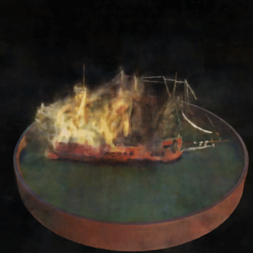
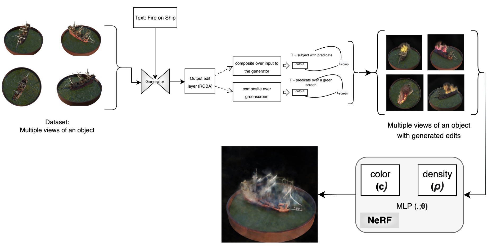
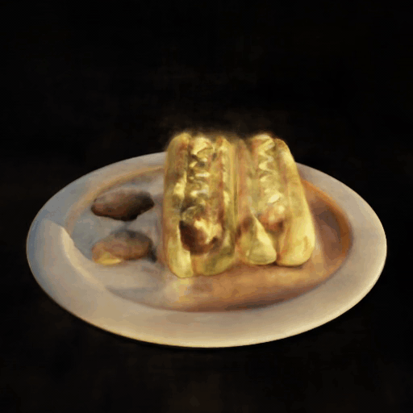
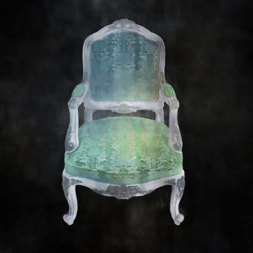
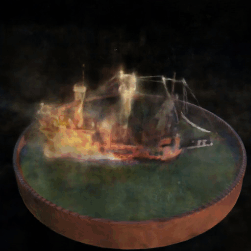

[![Contributors][contributors-shield]][contributors-url]
[![Forks][forks-shield]][forks-url]
[![Stargazers][stars-shield]][stars-url]
[![Issues][issues-shield]][issues-url]
[![MIT License][license-shield]][license-url]
[![LinkedIn][linkedin-shield]][linkedin-url]

<!-- PROJECT LOGO -->
 

    

  <h2 align="center">3D-Text2LIVE (BU GRS CS640 Project 2022)</h2>

  

    Zero-shot, text-driven appearance manipulation on multiple views of an object to generate 3D renderings.
     
    <a href="https://github.com/animikhaich/3D-Text2LIVE/issues/new">Report Bug</a>
    ·
    <a href="https://github.com/animikhaich/3D-Text2LIVE/issues/new">Request Feature</a>
  

  

<!-- TABLE OF CONTENTS -->

## Table of Contents

- [Table of Contents](#table-of-contents)
- [About The Project](#about-the-project)
- [Report and Presentation](#report-and-presentation)
- [Models and Results](#models-and-results)
- [Proposed Architecture](#proposed-architecture)
- [Sample Results](#sample-results)
  - [Golden Hotdog](#golden-hotdog)
  - [Ice Chair](#ice-chair)
  - [Ship on Fire](#ship-on-fire)
- [Hardware Requirements](#hardware-requirements)
- [License](#license)
- [Contributors](#contributors)
    - [Animikh Aich](#animikh-aich)
    - [Himanshu Patil](#himanshu-patil)
    - [Vedika Srivastava](#vedika-srivastava)
- [Acknowledgements](#acknowledgements)

<!-- ABOUT THE PROJECT -->

## About The Project

This project is a part of the Boston University Course: [GRS CS640 - Artificial Intelligence](https://www.bu.edu/academics/grs/courses/grs-cs-640/) and builds on top of Text2LIVE. In particular, it involves the following three papers:
- [Text2LIVE: Text-Driven Layered Image and Video Editing](https://arxiv.org/abs/2204.02491)
- [NeRF: Representing Scenes as Neural Radiance Fields for View Synthesis](https://arxiv.org/abs/2003.08934)
- [DreamFusion: Text-to-3D using 2D Diffusion](https://arxiv.org/abs/2209.14988)

A wide range of editing effects are now available to content creators thanks to extensive research into changing the appearance and style of objects in photographs. However, majority of the research in this field focuses on global editing rather than localized editing. To address this (Bar-Tal et al. 2022) developed an algorithm with localized editing of images using only text prompt. Given the substantial work being done on 3D objects and the widespread usage of 3D models in CAD modeling and video games, the same flexibility and range of editing effects ought to be available in 3D. Due to this, we propose 3D Text2LIVE, which gives the same degree of creative control over the appearance and style of 3D models as can be done with 2D photographs

## Report and Presentation

- Project report: [Report.pdf](3D-Text2LIVE-Report.pdf)
- Project Presentation: [Google Slides](https://docs.google.com/presentation/d/1qkIB610OA07HWhWi_xw1868-F6Q7jPR0n-6XszIIgFU/edit?usp=sharing)

## Models and Results

Link to the trained models and results can be found here: [Google Drive](https://drive.google.com/drive/folders/10AaqaCKmPoU0Hd6fiIWw5HUmnTbDtQNU?usp=sharing)
## Proposed Architecture

## Sample Results

### Golden Hotdog

### Ice Chair

### Ship on Fire

## Hardware Requirements

We recommend an [Nvidia GPU](https://www.nvidia.com/en-gb/graphics-cards/) for Training the models. As per our experimentation the following specifications are recommended:
- Text2LIVE: Nvidia A100 (or any GPU with VRAM greater than 18 GB)
- NeRF: Nvidia Tesla V100 (or any GPU with 11 GB VRAM or Higher)
- DreamFusion3D: Nvidia Tesla V100 (or any GPU with VRAM greater than 16 GB)

## License

Distributed under the [GNU AGPL V3 License](https://choosealicense.com/licenses/agpl-3.0/). See [LICENSE](LICENSE) for more information.

## Contributors
#### Animikh Aich

- LinkedIn: [animikh-aich](https://www.linkedin.com/in/animikh-aich/)
- Email: [animikh@bu.edu](mailto:animikhaich@gmail.com)
- GitHub: [animikhaich](https://github.com/animikhaich)
- Twitter: [@AichAnimikh](https://twitter.com/AichAnimikh)

#### Himanshu Patil

- LinkedIn: [hipatil](https://www.linkedin.com/in/hipatil/)
- Email: [hipatil@bu.edu](mailto:hipatil@bu.edu)
- GitHub: [HiPatil](https://github.com/HiPatil)

#### Vedika Srivastava 

- LinkedIn: [vedika-srivastava](https://www.linkedin.com/in/vedika-srivastava/)
- Email: [vedikas@bu.edu](mailto:vedikas@bu.edu)
- GitHub: [VedikaSrivastava](https://github.com/VedikaSrivastava)

[contributors-shield]: https://img.shields.io/github/contributors/animikhaich/3D-Text2LIVE.svg?style=flat-square
[contributors-url]: https://github.com/animikhaich/3D-Text2LIVE/graphs/contributors
[forks-shield]: https://img.shields.io/github/forks/animikhaich/3D-Text2LIVE.svg?style=flat-square
[forks-url]: https://github.com/animikhaich/3D-Text2LIVE/network/members
[stars-shield]: https://img.shields.io/github/stars/animikhaich/3D-Text2LIVE.svg?style=flat-square
[stars-url]: https://github.com/animikhaich/3D-Text2LIVE/stargazers
[issues-shield]: https://img.shields.io/github/issues/animikhaich/3D-Text2LIVE.svg?style=flat-square
[issues-url]: https://github.com/animikhaich/3D-Text2LIVE/issues
[license-shield]: https://img.shields.io/github/license/animikhaich/3D-Text2LIVE.svg?style=flat-square
[license-url]: https://github.com/animikhaich/3D-Text2LIVE/blob/main/LICENSE
[linkedin-shield]: https://img.shields.io/badge/-LinkedIn-black.svg?style=flat-square&logo=linkedin&colorB=555
[linkedin-url]: https://linkedin.com/in/animikh-aich/

## Acknowledgements
- [Omer Bar-Tal](https://github.com/omerbt) (Text2LIVE)
- [Omer Bar-Tal](https://github.com/yenchenlin) (NeRF)
- [Kiui - Jiaxiang Tang](https://github.com/ashawkey) (Stable Dreamfusion)